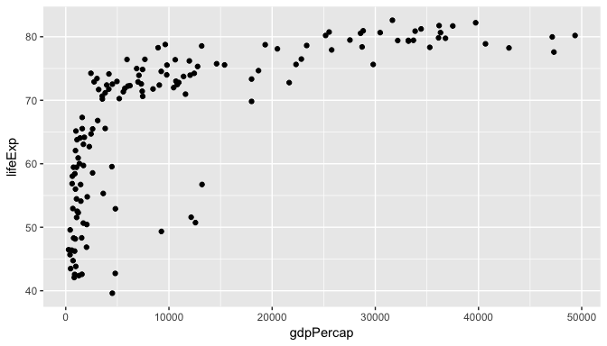
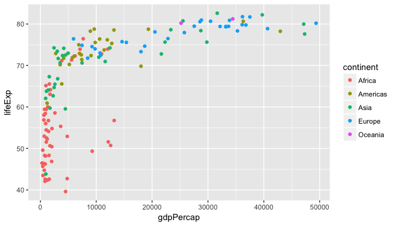

# Analyzing Gapminder data
Mine Cetinkaya-Rundel  
8/31/2017  


```r
library(readr)
library(ggplot2)
library(dplyr)
```

## Step 1: Load data


```r
gapminder <- read_csv("https://stat.duke.edu/~mc301/data/gapminder.csv")
```

```
## Parsed with column specification:
## cols(
##   country = col_character(),
##   continent = col_character(),
##   year = col_integer(),
##   lifeExp = col_double(),
##   pop = col_double(),
##   gdpPercap = col_double()
## )
```

## Step 2: Subset data

- Start with the `gapminder` dataset

- Filter for cases (rows) where year is equal to 2007

- Save this new subsetted dataset as `gap07`


```r
gap07 <- gapminder %>%
  filter(year == 2007)
```


## Step 3: Explore and visualize

**Task:** Visualize the relationship between `gdpPercap` and `lifeExp`.


```r
ggplot(data = gap07, aes(x = gdpPercap, y = lifeExp)) + 
  geom_point()
```

<!-- -->

## Step 4: Dig deeper

**Task:** Color the points by continent.


```r
ggplot(data = gap07, aes(x = gdpPercap, y = lifeExp, color = continent)) +
  geom_point()
```

<!-- -->

## Update your analysis

What if you wanted to now change your analysis 

- to subset for 1952

- plot life expectancy (`lifeExp`) vs. population (`pop`)

- and size the points by GPD (`gpdPercap`)
    - hint: add argument `size = gpdPercap` to your plotting code
